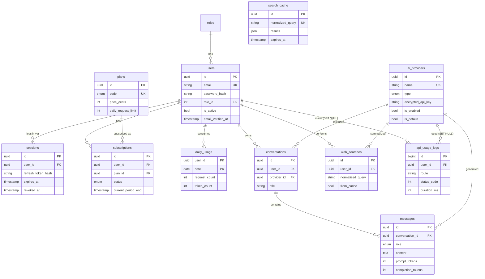

# EchoGPT Backend API

Production-ready REST API for the [EchoGPT](https://chromewebstore.google.com/detail/echogpt-multi-ai-chat-sid/negimdcamohmoheiifgecbjgjepkcfhj) multi-AI chat Chrome extension, built with **NestJS**, **PostgreSQL**, **Prisma** and **Swagger/OpenAPI**.

- 55 documented endpoints across auth, users, subscriptions, AI providers, chat (with streaming), web search, and admin
- OpenAI, Anthropic Claude and Google Gemini behind one adapter interface
- Session-backed JWT auth with refresh-token rotation and reuse detection
- Race-safe daily usage quotas, encrypted provider API keys, request logging and analytics

---

## Contents

- [Quick start](#quick-start)
- [Requirements coverage](#requirements-coverage)
- [Architecture](#architecture)
- [Database design](#database-design)
- [API overview](#api-overview)
- [Security](#security)
- [Key design decisions](#key-design-decisions)
- [Configuration](#configuration)
- [Testing](#testing)
- [Future improvements](#future-improvements)

---

## Quick start

**Prerequisites:** Node.js 24+, Docker.

```bash
# 1. Install dependencies (also generates the Prisma client)
npm install

# 2. Create your env file and generate real secrets
cp .env.example .env
node -e "console.log(require('crypto').randomBytes(48).toString('hex'))"   # → JWT_ACCESS_SECRET
node -e "console.log(require('crypto').randomBytes(48).toString('hex'))"   # → JWT_REFRESH_SECRET
node -e "console.log(require('crypto').randomBytes(32).toString('hex'))"   # → ENCRYPTION_KEY

# 3. Start PostgreSQL (host port 5433)
docker compose up -d

# 4. Apply migrations and seed roles, plans and an admin user
npx prisma migrate deploy
npm run db:seed

# 5. Run the API in watch mode
npm run start:dev
```

| URL | What |
|---|---|
| http://localhost:3000/docs | Swagger UI |
| http://localhost:3000/docs-json | OpenAPI spec (JSON) |
| http://localhost:3000/api/v1/health | Health check |

**Seeded admin:** `admin@echogpt.local` / `Admin@12345` (override with `SEED_ADMIN_EMAIL` / `SEED_ADMIN_PASSWORD`).

In Swagger, call `POST /auth/login`, click **Authorize**, paste the `accessToken`, then add an AI provider with `POST /admin/providers` before using chat.

### Run everything in Docker

```bash
docker compose --profile prod up -d --build
```

This starts Postgres, then a one-off `migrate` job (migrations + seed), then the API on port 3000. The API container runs as a non-root user and has a health check.

### Mock mode (no API keys needed)

With `AI_MOCK_RESPONSES=true` and `SEARCH_ENGINE=mock` (the defaults in `.env.example`), AI providers and web search return realistic fake data, so every endpoint, including streaming, works without paid keys. Mock AI is always disabled when `NODE_ENV=production`.

To use real models: set `AI_MOCK_RESPONSES=false` and add providers with real keys via `POST /admin/providers`. For real web search: `SEARCH_ENGINE=brave` plus a [Brave Search API](https://brave.com/search/api/) key.

---

## Requirements coverage

| Requirement | Implementation |
|---|---|
| **Auth:** register, login, logout, JWT, refresh, hashing | `auth/*`: bcrypt (cost 12), 15-minute access + 7-day refresh JWTs, per-device sessions, rotation with reuse detection, logout and logout-all |
| Email verification *(bonus)* | Hashed single-use token with 24h expiry; `verify-email`, `resend-verification` (link is logged; no mail provider) |
| **Users:** profile, update, change password, delete, roles | `users/*`: change password revokes other sessions; delete requires the password; `Role` table with `USER`/`ADMIN` and a global `RolesGuard` |
| **Subscriptions:** Free/Premium, status, upgrade/downgrade, limits, remaining | `subscriptions/*`: plans stored as data, lazy expiry, history, atomic daily quota, `GET /usage/me` |
| **AI providers:** add, edit, delete, enable/disable, secure keys, default, health check | `ai-providers/*`: AES-256-GCM encrypted keys, single-default invariant, per-provider and bulk health checks |
| **Chat:** send prompt, response, provider selection, history, streaming *(bonus)* | `chat/*`: provider/model selection with fallbacks, conversations + messages, SSE streaming with client-abort propagation |
| **Web search:** query, history, recent, suggestions, caching *(bonus)* | `search/*`: AI-summarized results with citations, shared TTL cache, distinct recents, ranked prefix suggestions |
| **Admin:** dashboard, users, subscriptions, providers, analytics, logs, health | `admin/*`, `health/*`: stats, user management, plan editing, p95 latency analytics, filterable request logs, system health |
| **Swagger:** params, bodies, examples, errors, auth | Every operation has a summary, typed DTOs with examples, documented error responses and bearer auth |
| **Database:** normalized schema with all listed tables | See [Database design](#database-design) |
| Docker *(optional)* | Multi-stage `Dockerfile` + Compose with a migration job |

---

## Architecture

```
src/
├── main.ts / app.setup.ts     bootstrap: helmet, CORS, /api/v1 prefix, ValidationPipe, Swagger
├── app.module.ts              wires modules, global guards, filter, logging middleware
├── config/                    Zod validation of environment variables (fail fast at boot)
├── prisma/                    PrismaService (single connection pool, lifecycle hooks)
├── common/                    cross-cutting: guards, decorators, filter, middleware, crypto, pagination
├── auth/                      register, login, refresh, logout, email verification
├── users/                     self-service profile, password, sessions, account deletion
├── subscriptions/             plans, subscriptions, UsageService (quotas)
├── ai-providers/              provider management + adapters/ (OpenAI, Anthropic, Gemini, Mock)
├── chat/                      prompts, SSE streaming, conversation history
├── search/                    web search, cache, history, suggestions + engines/
├── admin/                     dashboard, users, subscriptions/plans, analytics, logs
├── health/                    public and detailed health checks
└── generated/prisma/          generated Prisma client (git-ignored)
```

**Request pipeline:**

```
Request → RequestLoggerMiddleware → ThrottlerGuard → JwtAuthGuard → RolesGuard
        → ValidationPipe → Controller → Service → Prisma / AI adapter
        ← AllExceptionsFilter (uniform error JSON) ← response
```

- **Controllers** only handle HTTP. **Services** hold the business logic. Prisma is the data layer.
- **Secure by default:** `JwtAuthGuard` is global, so every route needs a token unless marked `@Public()`.
- **Adapters:** `ChatService` talks to one `AiAdapter` interface. Each vendor's request format, auth headers and streaming format are hidden in its own adapter class.

---

## Database design



**Design notes**

- **Normalized:** chat is split into `conversations` + `messages`; plans are a table, so limits change without a deploy; roles are a table.
- **Invariants enforced by the database**, not just the code: partial unique indexes guarantee at most **one ACTIVE subscription per user** and **one default AI provider**, even under concurrent requests ([migration](prisma/migrations/20260926200955_partial_unique_indexes/migration.sql)).
- **Delete behaviour:** deleting a user cascades to their sessions, chats, searches and usage. `api_usage_logs.user_id` is `SET NULL`, so analytics survive account deletion.
- **Indexes** on every foreign key, on `(user_id, created_at DESC)` for history screens, and a `text_pattern_ops` index for prefix search suggestions.
- **Key types:** UUID keys for anything exposed in URLs (not guessable); `BIGINT` autoincrement for the high-volume log table.

---

## API overview

All routes are prefixed with `/api/v1`. Full details, schemas and examples are in Swagger at `/docs`.

| Area | Endpoints |
|---|---|
| **Auth** | `POST /auth/register` · `login` · `refresh` · `logout` · `logout-all` · `verify-email` · `resend-verification` |
| **Users** | `GET/PATCH/DELETE /users/me` · `PATCH /users/me/password` · `GET /users/me/sessions` |
| **Subscriptions** | `GET /plans` · `GET /subscriptions/me` · `GET /subscriptions/me/history` · `POST /subscriptions/me/change` · `GET /usage/me` |
| **AI providers** | `GET /providers` (enabled providers and models) |
| **Chat** | `POST /chat` · `POST /chat/stream` (SSE) · `GET /chat/conversations` · `GET/PATCH/DELETE /chat/conversations/:id` |
| **Web search** | `POST /search` · `GET/DELETE /search/history` · `DELETE /search/history/:id` · `GET /search/recent` · `GET /search/suggestions` |
| **Admin: providers** | `POST/GET /admin/providers` · `GET/PATCH/DELETE /admin/providers/:id` · `PATCH …/:id/status` · `POST …/:id/default` · `POST …/:id/health-check` · `POST /admin/providers/health-check` |
| **Admin: users** | `GET /admin/users` · `GET/PATCH/DELETE /admin/users/:id` · `PATCH /admin/users/:id/subscription` · `POST /admin/users/:id/logout` |
| **Admin: subscriptions** | `GET /admin/subscriptions` · `GET /admin/plans` · `PATCH /admin/plans/:code` |
| **Admin: analytics** | `GET /admin/dashboard` · `GET /admin/analytics/usage` · `GET /admin/logs` |
| **System** | `GET /` · `GET /health` · `GET /admin/system/health` · `DELETE /admin/search-cache` |

### Streaming (`POST /chat/stream`)

The response is `text/event-stream`. Use `fetch` with a stream reader; `EventSource` only supports GET.

```
event: meta   data: {"conversationId":"…","provider":{"id":"…","name":"Claude"},"model":"claude-sonnet-5"}
event: delta  data: {"text":"Hello"}          ← repeated; append the text
event: done   data: { …same body as POST /chat… }
event: error  data: {"message":"…"}           ← only if the provider fails mid-stream
```

Validation, quota and ownership errors are returned as normal JSON errors **before** the stream starts. Closing the connection aborts the upstream AI request, and any partial reply is saved.

### Error format

Every error has the same shape:

```json
{ "statusCode": 429, "error": "TOO_MANY_REQUESTS", "message": "Daily limit of 20 requests reached on the Free plan…", "path": "/api/v1/chat", "timestamp": "…" }
```

---

## Security

| Concern | Measure |
|---|---|
| Passwords | bcrypt (cost 12); strength rules enforced; never selected in queries that feed responses |
| Tokens | Short-lived access JWT (15m); refresh JWT (7d) stored only as a **SHA-256 hash**; separate secrets for each |
| Session control | Every token is bound to a `sessions` row, so logout, password change, suspension and deletion take effect **immediately** |
| Stolen refresh token | Rotation on every refresh; re-use of an old token revokes **all** of the user's sessions |
| User enumeration | Same error for unknown email and wrong password; dummy bcrypt compare keeps timing equal |
| Brute force | Global rate limit (100/min/IP); 5/min on credential endpoints |
| Mass assignment | `ValidationPipe` with `whitelist` + `forbidNonWhitelisted` |
| Provider API keys | AES-256-GCM (random IV + auth tag); never returned, only `apiKeyLast4` |
| Authorization | Global `RolesGuard`; resource ownership checked in queries (`WHERE id AND user_id`); other users' data returns 404, not 403 |
| SQL injection | Prisma parameterized queries; raw SQL only via tagged templates (bind parameters); `LIKE` wildcards escaped |
| Headers / secrets | `helmet`; env validated at boot; `.env` git-ignored and excluded from the Docker image |

---

## Key design decisions

1. **Atomic quotas.** `UsageService.consume` checks and increments the counter in one statement: `INSERT … ON CONFLICT DO UPDATE … WHERE request_count < limit`. A read-then-write version would let parallel requests exceed the limit; this one cannot. Tested: 25 parallel requests against a limit of 20 gave exactly 20 successes and 5 × 429. Failed provider calls refund the request.
2. **Lazy subscription expiry.** Premium lasts 30 days. Instead of a cron job, expiry is checked whenever the subscription is read, and the user falls back to FREE automatically.
3. **Strategy pattern for AI vendors.** Adding a new provider means writing one adapter class; chat code stays unchanged.
4. **SSE over WebSockets** for streaming: the data flows one way, it's plain HTTP (works through proxies and CDNs), and it's the same protocol the vendors use.
5. **Cache-aside search cache** keyed by the *normalized* query and shared across users, with a TTL and hit counter.
6. **Request logging in middleware**, not an interceptor, so requests rejected by guards (401/403/429) are logged too. `AsyncLocalStorage` lets `ChatService` attach provider and token usage to the current request's log row without passing `req` around. Logs are written after the response is sent.
7. **No Passport.** The JWT guard is about 40 lines using `@nestjs/jwt` directly: less magic, and every step is visible.
8. **Mock adapters** make the whole API demoable and testable without paid keys, and are disabled automatically in production.

---

## Configuration

| Variable | Default | Description |
|---|---|---|
| `NODE_ENV` | `development` | `development` · `production` · `test` |
| `PORT` | `3000` | HTTP port |
| `DATABASE_URL` | - | PostgreSQL connection string |
| `POSTGRES_USER` / `POSTGRES_PASSWORD` / `POSTGRES_DB` / `POSTGRES_PORT` | `echogpt` … `5433` | Used by docker-compose |
| `JWT_ACCESS_SECRET` / `JWT_REFRESH_SECRET` | - | ≥ 32 chars each; use different values |
| `JWT_ACCESS_EXPIRES_IN` / `JWT_REFRESH_EXPIRES_IN` | `15m` / `7d` | Token lifetimes |
| `ENCRYPTION_KEY` | - | 64 hex chars (32 bytes) for AES-256-GCM |
| `AI_MOCK_RESPONSES` | `false` | Fake AI responses (ignored in production) |
| `AI_REQUEST_TIMEOUT_MS` | `60000` | Upstream AI timeout |
| `SEARCH_ENGINE` | `mock` | `mock` or `brave` |
| `SEARCH_API_KEY` | - | Required when `SEARCH_ENGINE=brave` |
| `SEARCH_CACHE_TTL_SECONDS` | `3600` | Search cache lifetime |

The app refuses to start if any variable is missing or invalid.

### Useful scripts

| Script | Purpose |
|---|---|
| `npm run start:dev` | Run with hot reload |
| `npm run build` / `npm run start:prod` | Compile / run the compiled app |
| `npm test` | Unit tests |
| `npm run test:e2e` | End-to-end tests (needs Postgres running) |
| `npm run prisma:migrate` | Create/apply a migration in development |
| `npm run prisma:deploy` | Apply migrations (CI/production) |
| `npm run prisma:studio` | Browse the database in a GUI |
| `npm run db:seed` | Seed roles, plans and the admin user |
| `npx prisma migrate reset` | Drop, re-migrate and re-seed the dev database |

---

## Testing

```bash
npm test            # unit tests
npm run test:e2e    # e2e tests: boots the real app against Postgres
```

- **Unit tests:** AES-GCM round-trip, fresh IV per encryption and tamper detection; the SSE parser with events split across network chunks; `RolesGuard`; query normalization.
- **E2E tests:** health, 401 error shape, mass-assignment rejection, register → profile → usage → logout → token rejected, and 403 on admin routes.

---

## Future improvements

- **Redis** for quotas, rate limiting and the search cache when running multiple instances (the throttler is currently in-memory per instance).
- **Stripe** Checkout + webhooks for real payments; plan changes would happen only in the verified webhook handler.
- **Email delivery** (SES/Resend) through a job queue (BullMQ) for verification emails.
- **Log retention:** partition `api_usage_logs` by month, or move it to a time-series store; pre-aggregate analytics.
- **Per-plan provider access** (for example, some models only for Premium) and token-based quotas.
- **Smaller runtime image:** the Prisma client pulls in its CLI and TypeScript as dependencies; a pruning step or bundling with a tool like `esbuild` would shrink it.
- **Observability:** OpenTelemetry tracing, structured JSON logs, Prometheus metrics.
